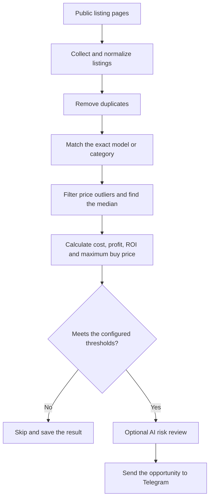

# Bahrain Flip Finder

I built this tool to help me compare used-electronics listings in Bahrain. It reads
public listing pages, groups similar products and works out whether the price leaves
enough room for resale after transport, repairs and selling costs.

The price calculation is regular Python code. AI review is optional and is mainly used
to check the product model, missing information and obvious risks.

## How it works

The scan follows the same path for every listing:



## What it does

- Reads public OpenSooq and Dubizzle listing pages.
- Extracts the title, price, condition, link and available images.
- Removes repeated listings.
- Matches the same model first, then falls back to products in the same category.
- Uses median prices and an IQR filter to reduce the effect of unusual asking prices.
- Calculates expected sale price, total cost, profit, ROI and maximum buying price.
- Saves processed listings and retry state in SQLite.
- Can review a result with Cloud5/TaBiToken or DeepSeek.
- Sends matching opportunities to Telegram.
- Runs once from the command line or continuously in watch mode.

## Price calculation

For each listing, the program finds nearby matches and prefers exact model numbers.
When there are enough prices, it removes large outliers and takes the median of the
remaining listings. It then applies `SALE_REALIZATION_RATE` because an asking price is
not necessarily the final selling price.

```text
total cost = listing price + transport + repair reserve + selling fees
profit = expected sale price - total cost
ROI = profit / total cost * 100
maximum buy = expected sale price - other costs - target profit
```

An item only passes when it meets the configured profit, ROI, confidence and comparable
count. AI cannot turn a failed price calculation into a buying candidate.

## Setup

Python 3.10 or newer is required.

```bash
git clone https://github.com/MaybeAwab/bahrain-flip-finder.git
cd bahrain-flip-finder
python -m venv .venv
```

Activate the environment on Windows:

```powershell
.venv\Scripts\Activate.ps1
```

Or on Linux and macOS:

```bash
source .venv/bin/activate
```

Install the project and create a local settings file:

```bash
python -m pip install -e .
```

```powershell
Copy-Item .env.example .env
```

On Linux or macOS, use `cp .env.example .env` instead.

## Configuration

The defaults are in [`.env.example`](.env.example). Start with these settings:

```dotenv
TRANSPORT_BHD=2
REPAIR_RESERVE_BHD=3
SALE_REALIZATION_RATE=0.85
TARGET_PROFIT_BHD=15
MINIMUM_ROI_PERCENT=25
MINIMUM_COMPARABLES=3
```

`FLIP_SOURCE_URLS` accepts a comma-separated list of public category or search pages.
If it is left empty, the built-in Bahrain electronics pages are used.

## Commands

Run one scan using local price checks:

```bash
python -m flip_finder scan
```

Fetch public detail pages and use AI review:

```bash
python -m flip_finder scan --details --ai
```

Send accepted results to Telegram:

```bash
python -m flip_finder scan --details --ai --telegram
```

Start watch mode with a 30-minute interval:

```bash
python -m flip_finder scan --details --ai --telegram --watch --interval 1800
```

Other useful commands:

```bash
python -m flip_finder scan --bootstrap
python -m flip_finder doctor
python -m flip_finder test-ai
python -m flip_finder test-telegram
```

## AI keys

Providers are tried in the order set by `AI_PROVIDER_ORDER`. Keys are used one at a
time. If a key is invalid, rate-limited or temporarily unavailable, it is put on
cooldown before the next key is tried. If none of that provider's keys work, the scan
moves to the next provider.

```dotenv
AI_PROVIDER_ORDER=cloud5,deepseek

CLOUD5_API_KEY_1=
CLOUD5_API_KEY_2=
CLOUD5_BASE_URL=https://tabitoken.com/v1
CLOUD5_MODEL=glm-5.3-flash

DEEPSEEK_API_KEY_1=
DEEPSEEK_API_KEY_2=
DEEPSEEK_BASE_URL=https://api.deepseek.com
DEEPSEEK_MODEL=deepseek-v4-flash
```

For Telegram, set `TELEGRAM_BOT_TOKEN` and `TELEGRAM_CHAT_ID`. The `.env` file and local
database files are ignored by Git.

## Files

| Path | Purpose |
| --- | --- |
| `src/flip_finder/collectors.py` | Public page requests and listing parsing |
| `src/flip_finder/pricing.py` | Matching, price filtering and profit calculations |
| `src/flip_finder/ai/providers.py` | Cloud5 and DeepSeek fallback |
| `src/flip_finder/storage.py` | SQLite state |
| `src/flip_finder/telegram.py` | Alert formatting and sending |
| `src/flip_finder/cli.py` | Commands and scan flow |
| `data/catalog_terms.json` | Categories and Arabic/English matching terms |
| `tests/` | Offline tests for the main logic |

## Tests

The tests do not contact listing sites, Telegram or paid APIs.

```bash
python -m pip install -e ".[dev]"
pytest
```

## Notes

- Listing prices are asking prices, not completed sales.
- Product condition still needs to be checked in person.
- Source sites can change their HTML, so parsers may need updates.
- The collector does not use private APIs or bypass login and CAPTCHA pages.

## License

MIT
